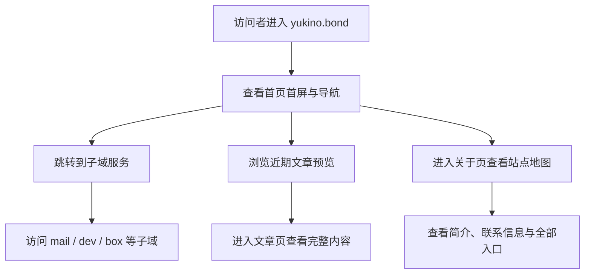

## 1. 产品概述
`yukino.bond` 是一个以“个人入口 + 轻博客 + 子域导航”为核心的静态站点，用来承载个人品牌展示、内容更新和各类子域服务入口。
- 主要目标是让访问者在进入根域名后，能快速理解站点用途，并一键跳转到 `mail.yukino.bond`、`dev.yukino.bond`、`box.yukino.bond` 等服务。
- 目标价值是把零散的个人服务整合成一个统一、好看、轻量、可长期维护的门户，同时完全适配 Cloudflare Pages 的无服务器托管方式。

## 2. 核心功能

### 2.1 功能模块
1. **首页**：品牌首屏、站点简介、子域名导航、内容预览、部署说明、页脚信息。
2. **文章页**：用于展示博客/笔记列表，可先使用静态示例内容，后续可扩展为 Markdown 驱动。
3. **关于页**：展示个人简介、常用服务、联系方式、站点地图。

### 2.2 页面细节
| 页面名称 | 模块名称 | 功能描述 |
|-----------|-------------|---------------------|
| 首页 | 首屏横幅 | 展示 `Yukino` 品牌名、简洁标语、进入内容区和子域导航的主按钮 |
| 首页 | 子域导航区 | 以卡片方式展示现有子域和建议子域，包含说明、用途、状态标签和跳转按钮 |
| 首页 | 内容预览区 | 展示近期文章、开发记录或收藏内容，强化“博客入口”定位 |
| 首页 | 站点理念区 | 说明该域名的组织方式、Cloudflare 托管策略、轻量架构理念 |
| 首页 | 页脚区 | 展示社交入口、邮箱入口、RSS/版权信息、回到顶部按钮 |
| 文章页 | 文章列表 | 以时间轴或卡片形式展示文章标题、摘要、标签和发布日期 |
| 文章页 | 筛选导航 | 提供按“开发 / 随笔 / 收藏”分类查看的交互入口 |
| 关于页 | 个人简介 | 展示站长介绍、兴趣方向、技术栈和站点愿景 |
| 关于页 | 服务地图 | 汇总全部子域与用途，作为完整站点地图使用 |
| 关于页 | 联系方式 | 提供邮箱、GitHub、其他外链入口 |

## 3. 核心流程
访问者进入根域名首页后，先看到清晰的个人品牌信息和页面主视觉，再通过导航栏或卡片区跳转到对应子域服务；若想了解内容更新，可继续浏览文章区或进入文章页；若想认识站长或查找全部入口，可进入关于页。

## 4. 用户界面设计
### 4.1 设计风格
- 主风格：夜色、冷调、带一点日系个人站气质的“静谧终端杂志风”
- 主色：深海军蓝、近黑灰、冰蓝高亮、少量雾紫点缀
- 按钮样式：圆角矩形、半透明描边、悬浮时发光与轻微上浮
- 字体建议：标题使用具有个性的衬线或展示字体，正文使用清爽的人文无衬线字体
- 布局方式：桌面优先，顶部导航 + 非对称首屏 + 卡片网格内容区
- 图标建议：使用线性图标和简洁状态徽标，避免过度拟物

### 4.2 页面设计概览
| 页面名称 | 模块名称 | UI 元素 |
|-----------|-------------|-------------|
| 首页 | 首屏横幅 | 大标题、副标题、背景光晕、主次按钮、滚动提示 |
| 首页 | 子域导航区 | 半透明卡片、用途说明、子域地址、状态标签、外链按钮 |
| 首页 | 内容预览区 | 杂志式排版、文章卡片、日期标签、分类徽章 |
| 首页 | 站点理念区 | 大段留白、说明文本、结构示意、Cloudflare 标记 |
| 文章页 | 文章列表 | 时间线、分类筛选、摘要卡片、阅读按钮 |
| 关于页 | 服务地图 | 清单式结构、分组标题、联系方式按钮 |

### 4.3 响应式
- 采用桌面优先设计，移动端收缩为单列布局
- 移动端导航切换为抽屉或折叠式菜单
- 卡片区域在平板端显示双列，在手机端显示单列
- 保持按钮点击区域足够大，兼顾触屏体验

## 5. 子域名规划建议
- `mail.yukino.bond`：邮箱入口，适合作为主联系通道
- `dev.yukino.bond`：开发小工具、在线脚本、效率页面集合
- `box.yukino.bond`：资源中转、文件索引、下载说明页
- `blog.yukino.bond`：独立博客正文站点，后续可放完整文章
- `links.yukino.bond`：极简导航页，适合作为移动端快捷入口
- `about.yukino.bond`：个人介绍、项目履历、联系方式
- `lab.yukino.bond`：实验性页面、前端玩具、视觉 Demo
- `status.yukino.bond`：服务状态页，可先静态展示“运营正常”

## 6. 内容策略建议
- 首页承担品牌展示与入口导航，不放过长正文
- 文章页用于短文、开发记录、折腾日志和资源整理
- 关于页用于沉淀长期不常变化的信息
- 可预留 “Uses / Friends / Changelog / RSS” 模块，增强个人站完整度

## 7. 托管与运营约束
- 站点必须支持纯静态部署，优先适配 Cloudflare Pages
- 根域名页面不依赖自建服务器
- 所有外链和子域跳转应支持后续逐步上线，不要求一次全部可用
- 页面应具备较好首屏性能与基础 SEO 结构
