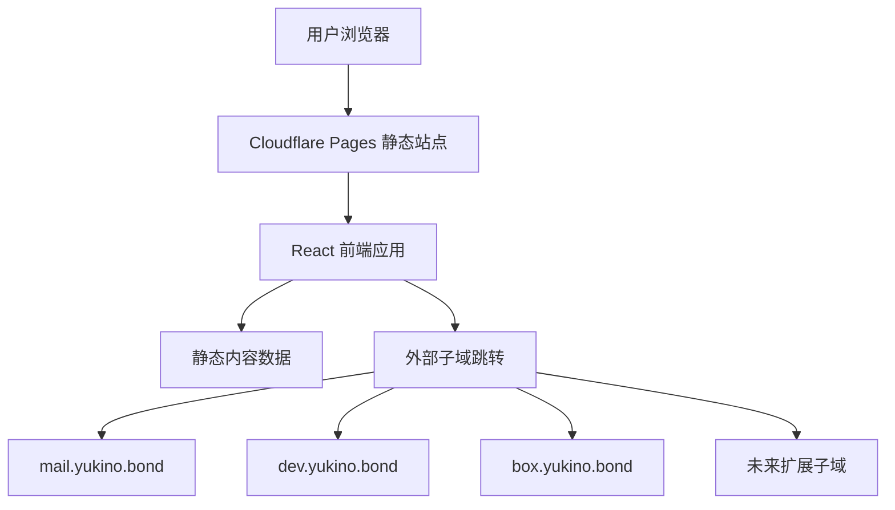

## 1. 架构设计


## 2. 技术说明
- 前端：React 18 + Vite + Tailwind CSS 3
- 初始化工具：Vite
- 路由：React Router
- 动画：CSS 动画为主，必要时少量使用原生过渡
- 数据：本地静态 JSON / TypeScript 常量
- 后端：无
- 数据库：无
- 托管：Cloudflare Pages
- 域名解析：Cloudflare DNS

## 3. 路由定义
| 路由 | 用途 |
|-------|---------|
| `/` | 首页，展示品牌首屏、子域导航和内容预览 |
| `/notes` | 文章或笔记列表页 |
| `/about` | 关于页与完整站点地图 |

## 4. 数据结构定义
站点采用纯静态数据驱动，不依赖后端接口。

```ts
type NavLink = {
  title: string;
  hostname: string;
  description: string;
  status: "online" | "planned";
  category: "core" | "content" | "experimental";
};

type PostPreview = {
  title: string;
  summary: string;
  date: string;
  tag: string;
  href: string;
};

type SiteProfile = {
  name: string;
  tagline: string;
  intro: string;
  email: string;
};
```

## 5. 组件结构
- `AppShell`：全局布局、背景、导航和页脚
- `TopNav`：顶部导航栏，包含页面路由和外部子域快捷入口
- `HeroSection`：首页首屏视觉区
- `DomainGrid`：子域导航卡片网格
- `PostPreviewList`：文章预览区
- `SitePhilosophy`：站点理念和结构说明区
- `NotesPage`：文章列表页
- `AboutPage`：关于页和站点地图

## 6. 样式策略
- 使用 Tailwind CSS 构建整体视觉和响应式布局
- 使用 CSS 变量统一颜色、阴影、边框和渐变
- 通过玻璃拟态、低饱和冷色光效和细边框塑造夜色气质
- 保持动画节奏克制，重点突出悬浮、渐入和滚动进入效果

## 7. Cloudflare 部署方案
- 代码仓库连接 Cloudflare Pages
- 生产构建命令：`npm run build`
- 输出目录：`dist`
- 根域名 `yukino.bond` 绑定到 Pages 项目
- 其他子域通过 Cloudflare DNS 指向对应服务
- 对于尚未上线的子域，可暂时指向静态占位页或保留规划状态

## 8. SEO 与性能策略
- 每个页面提供独立标题和描述
- 首页首屏文本采用真实语义标签，便于搜索引擎理解
- 图像资源尽量少且压缩，优先使用 CSS 视觉效果代替大图
- 首屏避免重型脚本，确保 Pages 静态托管环境下加载迅速

## 9. 后续扩展
- 可在不改动整体架构的前提下，把 `/notes` 接入 Markdown 内容系统
- 可逐步增加 RSS、友情链接、项目清单、更新日志页面
- 若未来需要动态能力，可按需接入 Cloudflare Workers，而不影响当前静态门户结构
